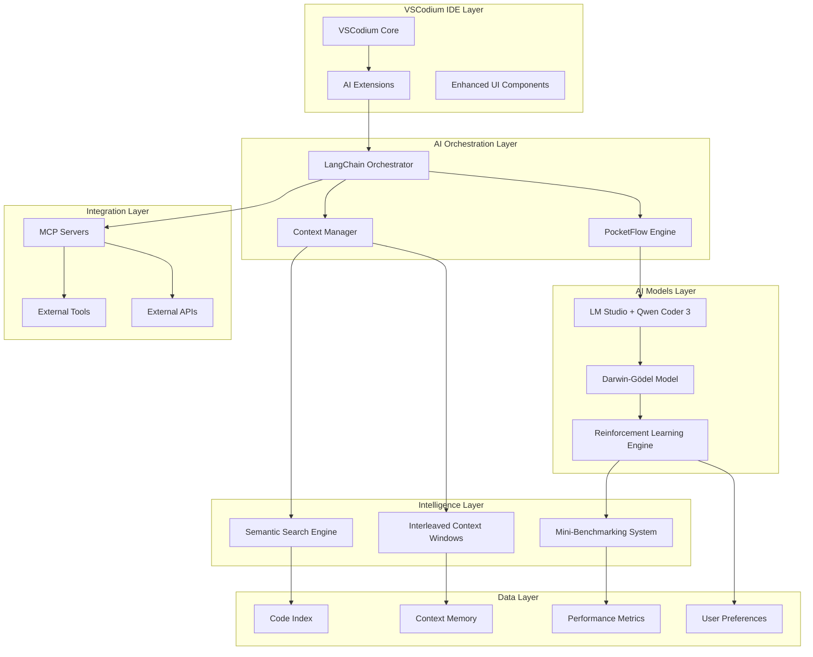

# AI IDE Design Document

## Overview

This design document outlines the architecture for an advanced AI-powered IDE built on VSCodium that integrates multiple cutting-edge AI technologies. The system combines the existing PocketFlow-based coding agent with new capabilities including semantic similarity search, self-improving AI models, and reinforcement learning to create a comprehensive development environment.

The AI IDE will extend the current VSCodium-based architecture with:
- Enhanced AI code assistance using LM Studio with Qwen Coder 3
- Semantic similarity search with interleaved context sliding windows
- Darwin-Gödel self-improving model with code rewriting capabilities
- Mini-benchmarking system for performance measurement
- Reinforcement learning for user preference adaptation
- Tool and MCP integration for extensibility

## Architecture

### High-Level System Architecture



### Core Components Integration

The system builds upon the existing PocketFlow-based coding agent architecture while adding new AI capabilities:

1. **VSCodium Foundation**: Extended with custom AI extensions
2. **Enhanced PocketFlow Engine**: Upgraded with semantic awareness and self-improvement
3. **LangChain Orchestration**: Manages complex AI workflows and tool chains
4. **Multi-Model AI System**: Combines Qwen Coder 3 with Darwin-Gödel self-improvement
5. **Intelligent Context Management**: Semantic search with sliding window optimization

## Components and Interfaces

### 1. VSCodium Extension Layer

**Purpose**: Provides the IDE interface and integrates AI capabilities into the development workflow.

**Key Components**:
- **AI Assistant Panel**: Interactive chat interface for code assistance
- **Semantic Search Widget**: Advanced code search with similarity ranking
- **Context Visualization**: Shows active context windows and relevance scores
- **Performance Dashboard**: Displays AI model performance metrics and improvements

**Interfaces**:
```typescript
interface AIExtensionAPI {
  // Code assistance
  requestCodeCompletion(context: CodeContext): Promise<CodeSuggestion[]>
  requestCodeGeneration(prompt: string, context: CodeContext): Promise<GeneratedCode>
  
  // Semantic search
  semanticSearch(query: string, options: SearchOptions): Promise<SearchResult[]>
  
  // Context management
  getActiveContext(): ContextWindow[]
  updateContextRelevance(contextId: string, relevance: number): void
  
  // Performance monitoring
  getModelPerformance(): PerformanceMetrics
  subscribeToImprovements(callback: (improvement: ModelImprovement) => void): void
}
```

### 2. LangChain Orchestration Engine

**Purpose**: Manages complex AI workflows, tool chains, and multi-step reasoning processes.

**Key Components**:
- **Workflow Manager**: Orchestrates multi-step AI tasks
- **Tool Chain Builder**: Dynamically constructs tool sequences
- **Context Router**: Directs queries to appropriate AI models
- **Result Aggregator**: Combines outputs from multiple AI sources

**Interfaces**:
```python
class LangChainOrchestrator:
    def create_workflow(self, task_type: str, context: Dict) -> Workflow
    def execute_chain(self, chain: Chain, inputs: Dict) -> ChainResult
    def register_tool(self, tool: Tool) -> None
    def get_optimal_model(self, task: Task) -> ModelConfig
```

### 3. Enhanced PocketFlow Engine

**Purpose**: Extends the existing PocketFlow system with AI-aware capabilities and self-improvement.

**Key Enhancements**:
- **Semantic Node Routing**: Routes tasks based on semantic understanding
- **Dynamic Flow Generation**: Creates workflows based on code context
- **Performance Tracking**: Monitors and optimizes flow execution
- **Self-Modifying Flows**: Updates workflows based on success patterns

**Enhanced Flow Structure**:
```python
class AIAwareFlow(Flow):
    def __init__(self, semantic_router: SemanticRouter, performance_tracker: PerformanceTracker):
        self.semantic_router = semantic_router
        self.performance_tracker = performance_tracker
        self.improvement_history = []
    
    def route_semantically(self, task: Task) -> Node
    def track_performance(self, execution: FlowExecution) -> Metrics
    def suggest_improvements(self) -> List[FlowImprovement]
```

### 4. Semantic Search Engine

**Purpose**: Provides intelligent code search using semantic similarity and contextual understanding.

**Key Components**:
- **Code Embeddings Generator**: Creates semantic representations of code
- **Similarity Calculator**: Computes semantic similarity scores
- **Context-Aware Ranker**: Ranks results based on current development context
- **Incremental Indexer**: Updates embeddings as code changes

**Implementation**:
```python
class SemanticSearchEngine:
    def __init__(self, embedding_model: str, vector_store: VectorStore):
        self.embedding_model = embedding_model
        self.vector_store = vector_store
        self.context_weights = {}
    
    def index_codebase(self, codebase_path: str) -> None
    def search_similar(self, query: str, context: CodeContext) -> List[SearchResult]
    def update_context_weights(self, feedback: UserFeedback) -> None
    def reindex_changed_files(self, changed_files: List[str]) -> None
```

### 5. Interleaved Context Sliding Windows

**Purpose**: Manages context efficiently using Apple's interleaved context sliding window technique with semantic similarity.

**Key Features**:
- **Dynamic Window Sizing**: Adjusts window size based on task complexity
- **Semantic Prioritization**: Keeps most relevant context in active windows
- **Interleaved Processing**: Processes multiple context streams simultaneously
- **Memory Optimization**: Efficiently manages large context requirements

**Implementation**:
```python
class InterleaveContextManager:
    def __init__(self, max_context_length: int, similarity_threshold: float):
        self.max_context_length = max_context_length
        self.similarity_threshold = similarity_threshold
        self.active_windows = []
        self.context_cache = {}
    
    def add_context(self, context: CodeContext, priority: float) -> None
    def get_relevant_context(self, query: str) -> List[ContextWindow]
    def optimize_windows(self) -> None
    def evict_least_relevant(self) -> None
```

### 6. Darwin-Gödel Self-Improving Model

**Purpose**: Implements a self-improving AI system that can rewrite and optimize its own code.

**Key Components**:
- **Code Analysis Engine**: Analyzes current implementation for improvement opportunities
- **Improvement Generator**: Generates potential code modifications
- **Safety Validator**: Ensures proposed changes are safe and beneficial
- **Version Manager**: Manages different versions of self-modified code

**Architecture**:
```python
class DarwinGodelModel:
    def __init__(self, base_model: str, safety_checker: SafetyChecker):
        self.base_model = base_model
        self.safety_checker = safety_checker
        self.improvement_candidates = []
        self.version_history = []
    
    def analyze_performance(self, metrics: PerformanceMetrics) -> List[ImprovementOpportunity]
    def generate_improvements(self, opportunities: List[ImprovementOpportunity]) -> List[CodeModification]
    def validate_safety(self, modification: CodeModification) -> SafetyResult
    def apply_improvement(self, modification: CodeModification) -> None
    def rollback_to_version(self, version_id: str) -> None
```

### 7. Mini-Benchmarking System

**Purpose**: Provides rapid performance measurement and validation for AI model improvements.

**Key Features**:
- **Micro-Benchmarks**: Quick tests for specific functionality
- **Performance Regression Detection**: Identifies when changes hurt performance
- **Quality Metrics**: Measures code quality, accuracy, and user satisfaction
- **Automated Testing**: Runs benchmarks automatically after improvements

**Implementation**:
```python
class MiniBenchmarkSystem:
    def __init__(self, benchmark_suite: BenchmarkSuite):
        self.benchmark_suite = benchmark_suite
        self.baseline_metrics = {}
        self.performance_history = []
    
    def run_benchmarks(self, model_version: str) -> BenchmarkResults
    def compare_performance(self, current: BenchmarkResults, baseline: BenchmarkResults) -> ComparisonResult
    def validate_improvement(self, improvement: ModelImprovement) -> ValidationResult
    def update_baseline(self, new_baseline: BenchmarkResults) -> None
```

### 8. Reinforcement Learning Engine

**Purpose**: Learns from user interactions and feedback to improve AI assistance over time.

**Key Components**:
- **Feedback Collector**: Gathers user interactions and preferences
- **Reward Calculator**: Computes rewards based on user satisfaction
- **Policy Updater**: Updates AI behavior based on learned preferences
- **Preference Predictor**: Predicts user preferences for new situations

**Implementation**:
```python
class ReinforcementLearningEngine:
    def __init__(self, policy_network: PolicyNetwork, reward_function: RewardFunction):
        self.policy_network = policy_network
        self.reward_function = reward_function
        self.experience_buffer = []
        self.user_preferences = {}
    
    def collect_feedback(self, interaction: UserInteraction) -> None
    def calculate_reward(self, action: AIAction, feedback: UserFeedback) -> float
    def update_policy(self, experiences: List[Experience]) -> None
    def predict_user_preference(self, context: Context, options: List[Option]) -> Prediction
```

## Data Models

### Core Data Structures

```python
@dataclass
class CodeContext:
    file_path: str
    content: str
    cursor_position: int
    selected_text: Optional[str]
    project_context: ProjectContext
    semantic_embedding: Optional[np.ndarray]

@dataclass
class SearchResult:
    file_path: str
    line_number: int
    content: str
    similarity_score: float
    context_relevance: float
    snippet: str

@dataclass
class ContextWindow:
    id: str
    content: str
    relevance_score: float
    last_accessed: datetime
    semantic_embedding: np.ndarray
    priority: int

@dataclass
class ModelImprovement:
    id: str
    description: str
    code_changes: List[CodeModification]
    performance_gain: float
    validation_results: ValidationResult
    timestamp: datetime

@dataclass
class UserFeedback:
    interaction_id: str
    action_taken: str
    user_rating: int  # 1-5 scale
    explicit_feedback: Optional[str]
    implicit_signals: Dict[str, Any]
    timestamp: datetime

@dataclass
class PerformanceMetrics:
    response_time: float
    accuracy_score: float
    user_satisfaction: float
    code_quality_score: float
    memory_usage: int
    cpu_usage: float
```

### Database Schema

```sql
-- Code embeddings and semantic search
CREATE TABLE code_embeddings (
    id UUID PRIMARY KEY,
    file_path VARCHAR(500) NOT NULL,
    content_hash VARCHAR(64) NOT NULL,
    embedding VECTOR(1536),
    created_at TIMESTAMP DEFAULT NOW(),
    updated_at TIMESTAMP DEFAULT NOW()
);

-- User interactions and feedback
CREATE TABLE user_interactions (
    id UUID PRIMARY KEY,
    user_id VARCHAR(100),
    action_type VARCHAR(50) NOT NULL,
    context JSONB,
    ai_response JSONB,
    user_feedback INTEGER,
    timestamp TIMESTAMP DEFAULT NOW()
);

-- Model performance tracking
CREATE TABLE performance_metrics (
    id UUID PRIMARY KEY,
    model_version VARCHAR(50) NOT NULL,
    metric_type VARCHAR(50) NOT NULL,
    metric_value FLOAT NOT NULL,
    benchmark_context JSONB,
    timestamp TIMESTAMP DEFAULT NOW()
);

-- Self-improvement history
CREATE TABLE model_improvements (
    id UUID PRIMARY KEY,
    improvement_type VARCHAR(50) NOT NULL,
    description TEXT,
    code_changes JSONB,
    performance_before JSONB,
    performance_after JSONB,
    validation_results JSONB,
    applied_at TIMESTAMP DEFAULT NOW()
);
```

## Error Handling

### Error Categories and Strategies

1. **AI Model Failures**
   - **Timeout Errors**: Implement circuit breakers and fallback to simpler models
   - **API Failures**: Graceful degradation to offline capabilities
   - **Invalid Responses**: Response validation and retry mechanisms

2. **Context Management Errors**
   - **Memory Overflow**: Automatic context pruning and compression
   - **Embedding Failures**: Fallback to text-based search
   - **Index Corruption**: Automatic reindexing with progress indicators

3. **Self-Improvement Errors**
   - **Unsafe Modifications**: Strict validation and sandboxed testing
   - **Performance Regression**: Automatic rollback mechanisms
   - **Validation Failures**: Quarantine improvements for manual review

4. **User Experience Errors**
   - **Slow Response Times**: Progressive loading and partial results
   - **Incorrect Suggestions**: Learning from negative feedback
   - **Context Loss**: Persistent context storage and recovery

### Error Recovery Mechanisms

```python
class ErrorRecoveryManager:
    def __init__(self):
        self.fallback_strategies = {
            'ai_model_failure': self.fallback_to_simple_completion,
            'context_overflow': self.compress_context,
            'embedding_failure': self.fallback_to_text_search,
            'improvement_failure': self.rollback_improvement
        }
    
    def handle_error(self, error: Exception, context: Dict) -> RecoveryResult:
        error_type = self.classify_error(error)
        strategy = self.fallback_strategies.get(error_type)
        if strategy:
            return strategy(error, context)
        return self.default_error_handling(error, context)
```

## Testing Strategy

### Testing Pyramid

1. **Unit Tests**
   - Individual component functionality
   - AI model response validation
   - Context management operations
   - Semantic search accuracy

2. **Integration Tests**
   - VSCodium extension integration
   - LangChain workflow execution
   - Database operations
   - External tool integration

3. **End-to-End Tests**
   - Complete user workflows
   - Multi-step AI assistance scenarios
   - Performance under load
   - Self-improvement cycles

4. **AI-Specific Tests**
   - Model output quality validation
   - Semantic similarity accuracy
   - Context relevance scoring
   - Improvement safety validation

### Continuous Testing Framework

```python
class AITestFramework:
    def __init__(self):
        self.test_suites = {
            'semantic_accuracy': SemanticAccuracyTests(),
            'context_relevance': ContextRelevanceTests(),
            'improvement_safety': ImprovementSafetyTests(),
            'user_satisfaction': UserSatisfactionTests()
        }
    
    def run_continuous_tests(self) -> TestResults:
        results = {}
        for suite_name, suite in self.test_suites.items():
            results[suite_name] = suite.run()
        return TestResults(results)
    
    def validate_improvement(self, improvement: ModelImprovement) -> ValidationResult:
        # Run safety and performance tests before applying improvements
        safety_result = self.test_suites['improvement_safety'].validate(improvement)
        if not safety_result.passed:
            return ValidationResult(passed=False, reason=safety_result.reason)
        
        performance_result = self.run_performance_tests(improvement)
        return ValidationResult(
            passed=performance_result.improvement_detected,
            metrics=performance_result.metrics
        )
```

### Performance Benchmarks

- **Response Time**: < 500ms for code completions, < 2s for complex generations
- **Accuracy**: > 85% for code completions, > 75% for semantic search relevance
- **Memory Usage**: < 2GB for typical development sessions
- **CPU Usage**: < 30% average during active AI assistance
- **User Satisfaction**: > 4.0/5.0 average rating for AI suggestions