# AI IDE Design Document

## Overview

This design document outlines the architecture for building a COMPLETE, FULLY-FUNCTIONAL IDE that has EVERY feature of VSCode, Cursor, and Kiro combined. This is not a toy or demo - this is a production-ready IDE that developers can use as their primary development environment.

**What "Complete IDE" Means:**
- **EVERY VSCode Feature**: Complete File menu (New, Open, Save, Save As, Save All, Recent Files, etc.), Edit menu (Undo, Redo, Cut, Copy, Paste, Find, Replace, etc.), Selection menu, View menu, Go menu, Run menu, Terminal menu, Help menu
- **EVERY VSCode UI Component**: File Explorer, Search, Source Control, Run & Debug, Extensions, full right-click context menus, status bar, activity bar, side panels, integrated terminal
- **EVERY VSCode Operation**: File operations (create, open, save, delete, rename, move), editing operations (syntax highlighting, IntelliSense, code folding, multi-cursor), debugging (breakpoints, watch, call stack), git integration (diff, commit, push, pull, merge), extension marketplace
- **EVERY Cursor AI Feature**: Ctrl+K inline generation, Ctrl+L chat, AI code editing, codebase awareness, @ references
- **EVERY Kiro Feature**: Autonomy modes, chat context (#File, #Folder, etc.), steering system, spec system, agent hooks, MCP integration

**Architecture Philosophy**: 
- **Start with REAL VSCode**: Use actual VSCode/Code-OSS source code as the foundation, not a fake recreation
- **Build Complete IDE First**: Ensure 100% of standard IDE functionality works before adding AI
- **Layer AI On Top**: Add AI features as extensions that enhance, never replace, core functionality
- **Production Quality**: Every feature must work as well as the original VSCode/Cursor/Kiro

**Non-Negotiable Requirements:**
- File menu must have ALL standard items: New File, New Window, Open File, Open Folder, Open Workspace, Open Recent, Save, Save As, Save All, Auto Save, Preferences, Exit
- Edit menu must have ALL standard items: Undo, Redo, Cut, Copy, Paste, Find, Find in Files, Replace, Replace in Files, Toggle Line Comment, etc.
- Right-click context menus must have ALL appropriate options for files, folders, and code
- File Explorer must support ALL operations: create, delete, rename, move, copy, drag & drop
- Terminal must be fully integrated with shell support, multiple terminals, split terminals
- Git integration must be complete: diff views, commit, push, pull, merge, branch management, conflict resolution
- Extensions marketplace must work with Open VSX or VSCode marketplace
- Debugging must be complete: breakpoints, step through, watch variables, call stack, debug console
- Search must work: find in files, replace in files, regex support, case sensitivity
- Settings must be complete: user settings, workspace settings, keybindings, themes, extensions settings

## Architecture

### High-Level System Architecture

```mermaid
graph TB
    subgraph "Complete VSCode/Code-OSS Foundation"
        VSC[VSCode Core - 100% Standard Features]
        EDIT[Editor + Syntax Highlighting]
        DEBUG[Debugger + Breakpoints]
        GIT[Git Integration + Diff Views]
        TERM[Integrated Terminal]
        EXT_MKT[Extensions Marketplace]
        THEMES[Themes + Settings]
        FILES[File Explorer + Search]
    end
    
    subgraph "Cursor-Level AI Extensions Layer"
        CTRL_K[Ctrl+K Inline Generation]
        CTRL_L[Ctrl+L AI Chat Panel]
        AUTOCOMPLETE[AI Autocomplete]
        CODE_EDIT[AI Code Editing]
        CONTEXT[Codebase Context Awareness]
    end
    
    subgraph "Kiro Feature Layer"
        AUTONOMY[Autonomy Mode Manager]
        CHAT_CTX[Chat Context System]
        STEERING[Steering System]
        SPECS[Spec System]
        HOOKS[Agent Hooks System]
        MCP_INT[MCP Integration]
        KIRO_FS[Kiro File System]
    end
    
    subgraph "Universal AI Provider Layer"
        OPENAI[OpenAI GPT-4/o1]
        ANTHROPIC[Anthropic Claude]
        OPENROUTER[OpenRouter Models]
        OLLAMA[Ollama Local Models]
        LMS[LM Studio + Qwen Coder 3]
        LLAMACPP[llama.cpp Integration]
    end
    
    subgraph "Advanced AI Orchestration Layer"
        LC[LangChain Orchestrator]
        PF[PocketFlow Engine]
        CTX[Context Manager]
        ROUTER[AI Model Router]
    end
    
    subgraph "Intelligence Enhancement Layer"
        SEM[Semantic Search Engine]
        ICW[Interleaved Context Windows]
        DG[Darwin-Gödel Self-Improvement]
        RL[Reinforcement Learning]
        MB[Mini-Benchmarking System]
    end
    
    subgraph "Integration & Tools Layer"
        MCP[MCP Servers]
        TOOLS[External Tools]
        API[External APIs]
        WEB[Web Search Integration]
    end
    
    subgraph "Data & Performance Layer"
        IDX[Code Index + Embeddings]
        MEM[Context Memory]
        PERF[Performance Metrics]
        USER[User Preferences]
        CACHE[Response Caching]
    end
    
    %% VSCode Foundation connections
    VSC --> EDIT
    VSC --> DEBUG
    VSC --> GIT
    VSC --> TERM
    VSC --> EXT_MKT
    VSC --> THEMES
    VSC --> FILES
    
    %% AI Extensions layer on top of VSCode
    EDIT --> CTRL_K
    EDIT --> AUTOCOMPLETE
    CTRL_K --> CODE_EDIT
    CTRL_L --> CONTEXT
    
    %% Kiro Features integrate with VSCode and AI
    FILES --> KIRO_FS
    EDIT --> AUTONOMY
    CTRL_L --> CHAT_CTX
    CTRL_L --> STEERING
    VSC --> SPECS
    VSC --> HOOKS
    
    %% Kiro Features connect to AI systems
    CHAT_CTX --> CTX
    STEERING --> CTX
    SPECS --> LC
    HOOKS --> LC
    AUTONOMY --> ROUTER
    
    %% AI Extensions connect to Universal AI Providers
    CTRL_K --> ROUTER
    CTRL_L --> ROUTER
    AUTOCOMPLETE --> ROUTER
    CODE_EDIT --> ROUTER
    
    %% Router distributes to AI providers
    ROUTER --> OPENAI
    ROUTER --> ANTHROPIC
    ROUTER --> OPENROUTER
    ROUTER --> OLLAMA
    ROUTER --> LMS
    ROUTER --> LLAMACPP
    
    %% AI Providers connect to orchestration
    OPENAI --> LC
    ANTHROPIC --> LC
    LMS --> LC
    LC --> PF
    LC --> CTX
    
    %% Advanced intelligence features
    CTX --> SEM
    CTX --> ICW
    PF --> DG
    DG --> RL
    RL --> MB
    
    %% Data layer connections
    SEM --> IDX
    ICW --> MEM
    MB --> PERF
    RL --> USER
    ROUTER --> CACHE
    
    %% External integrations
    LC --> MCP
    MCP --> TOOLS
    MCP --> API
    MCP --> WEB
    MCP_INT --> MCP
    
    %% Kiro File System connections
    KIRO_FS --> STEERING
    KIRO_FS --> SPECS
    KIRO_FS --> MCP_INT
```



### Core Components Integration

The system builds upon the existing PocketFlow-based coding agent architecture while adding new AI capabilities:

1. **VSCodium Foundation**: Extended with custom AI extensions
2. **Enhanced PocketFlow Engine**: Upgraded with semantic awareness and self-improvement
3. **LangChain Orchestration**: Manages complex AI workflows and tool chains
4. **Multi-Model AI System**: Combines Qwen Coder 3 with Darwin-Gödel self-improvement
5. **Intelligent Context Management**: Semantic search with sliding window optimization

## Components and Interfaces

### 1. Complete VSCode Foundation Layer

**Purpose**: Provides 100% of VSCode functionality - this is the actual VSCode/Code-OSS codebase, not a recreation.

**REQUIRED File Menu Items**:
- New File (Ctrl+N)
- New Window (Ctrl+Shift+N)
- Open File (Ctrl+O)
- Open Folder (Ctrl+K Ctrl+O)
- Open Workspace from File
- Open Recent (submenu with recent files, folders, workspaces)
- Add Folder to Workspace
- Save Workspace As
- Duplicate Workspace
- Save (Ctrl+S)
- Save As (Ctrl+Shift+S)
- Save All (Ctrl+K S)
- Auto Save (toggle)
- Preferences (Settings, Keyboard Shortcuts, User Snippets, Color Theme, File Icon Theme, Product Icon Theme)
- Exit (Ctrl+Q)

**REQUIRED Edit Menu Items**:
- Undo (Ctrl+Z)
- Redo (Ctrl+Y)
- Cut (Ctrl+X)
- Copy (Ctrl+C)
- Paste (Ctrl+V)
- Find (Ctrl+F)
- Find Next (F3)
- Find Previous (Shift+F3)
- Find in Files (Ctrl+Shift+F)
- Replace (Ctrl+H)
- Replace in Files (Ctrl+Shift+H)
- Toggle Line Comment (Ctrl+/)
- Toggle Block Comment (Shift+Alt+A)
- Emmet: Expand Abbreviation
- And ALL other standard edit operations

**REQUIRED Selection Menu Items**:
- Select All (Ctrl+A)
- Expand Selection (Shift+Alt+Right)
- Shrink Selection (Shift+Alt+Left)
- Copy Line Up (Shift+Alt+Up)
- Copy Line Down (Shift+Alt+Down)
- Move Line Up (Alt+Up)
- Move Line Down (Alt+Down)
- Duplicate Selection
- Add Cursor Above (Ctrl+Alt+Up)
- Add Cursor Below (Ctrl+Alt+Down)
- Add Cursors to Line Ends
- Select All Occurrences (Ctrl+F2)
- And ALL other selection operations

**REQUIRED View Menu Items**:
- Command Palette (Ctrl+Shift+P)
- Open View (submenu)
- Appearance (submenu with Status Bar, Activity Bar, Side Bar, Panel, etc.)
- Editor Layout (Split Up, Split Down, Split Left, Split Right, etc.)
- Explorer (Ctrl+Shift+E)
- Search (Ctrl+Shift+F)
- Source Control (Ctrl+Shift+G)
- Run and Debug (Ctrl+Shift+D)
- Extensions (Ctrl+Shift+X)
- Problems (Ctrl+Shift+M)
- Output (Ctrl+Shift+U)
- Terminal (Ctrl+`)
- Debug Console (Ctrl+Shift+Y)
- And ALL other view options

**REQUIRED Go Menu Items**:
- Back (Alt+Left)
- Forward (Alt+Right)
- Last Edit Location (Ctrl+K Ctrl+Q)
- Go to File (Ctrl+P)
- Go to Symbol in Workspace (Ctrl+T)
- Go to Symbol in Editor (Ctrl+Shift+O)
- Go to Definition (F12)
- Go to Declaration (Ctrl+F12)
- Go to Type Definition
- Go to Implementations (Ctrl+F12)
- Go to References (Shift+F12)
- Go to Line (Ctrl+G)
- Go to Bracket (Ctrl+Shift+\)
- And ALL other navigation options

**REQUIRED Run Menu Items**:
- Start Debugging (F5)
- Run Without Debugging (Ctrl+F5)
- Stop Debugging (Shift+F5)
- Restart Debugging (Ctrl+Shift+F5)
- Open Configurations
- Add Configuration
- Toggle Breakpoint (F9)
- New Breakpoint (submenu)
- Enable All Breakpoints
- Disable All Breakpoints
- Remove All Breakpoints
- And ALL other debugging options

**REQUIRED Terminal Menu Items**:
- New Terminal (Ctrl+Shift+`)
- Split Terminal (Ctrl+Shift+5)
- Kill Terminal
- Kill All Terminals
- Rename Terminal
- Change Icon
- Change Color
- Configure Terminal Settings
- And ALL other terminal options

**REQUIRED Help Menu Items**:
- Welcome
- Show All Commands (Ctrl+Shift+P)
- Documentation
- Show Release Notes
- Keyboard Shortcuts Reference (Ctrl+K Ctrl+R)
- Video Tutorials
- Tips and Tricks
- Join Us on YouTube
- Search Feature Requests
- Report Issue
- View License
- Privacy Statement
- Toggle Developer Tools (Ctrl+Shift+I)
- About

**REQUIRED Right-Click Context Menus**:

*File Explorer Context Menu*:
- New File
- New Folder
- Open
- Open to the Side
- Reveal in File Explorer
- Open in Integrated Terminal
- Find in Folder
- Cut, Copy, Paste
- Copy Path
- Copy Relative Path
- Rename
- Delete
- Download (for remote)

*Editor Context Menu*:
- Cut, Copy, Paste
- Command Palette
- Change All Occurrences (Ctrl+F2)
- Format Document (Shift+Alt+F)
- Format Selection
- Go to Definition (F12)
- Go to Declaration
- Go to Type Definition
- Go to Implementations
- Go to References (Shift+F12)
- Rename Symbol (F2)
- Change All Occurrences
- Refactor
- Source Action
- Peek (submenu)
- Insert Snippet
- Surround With
- And ALL other code operations

**Implementation Requirements**:
```typescript
// This must be the ACTUAL VSCode codebase, not a recreation
interface CompleteVSCodeFoundation {
  // File operations - ALL must work
  fileOperations: {
    newFile(): void;
    openFile(): void;
    openFolder(): void;
    save(): void;
    saveAs(): void;
    saveAll(): void;
    // ... ALL other file operations
  };
  
  // Editor operations - ALL must work
  editorOperations: {
    undo(): void;
    redo(): void;
    cut(): void;
    copy(): void;
    paste(): void;
    find(): void;
    replace(): void;
    // ... ALL other editor operations
  };
  
  // UI components - ALL must work
  uiComponents: {
    fileExplorer: FileExplorer;
    searchPanel: SearchPanel;
    sourceControl: SourceControlPanel;
    debugPanel: DebugPanel;
    extensionsPanel: ExtensionsPanel;
    terminal: IntegratedTerminal;
    statusBar: StatusBar;
    activityBar: ActivityBar;
    // ... ALL other UI components
  };
  
  // Extension system - must work with Open VSX
  extensionSystem: {
    installExtension(extensionId: string): Promise<void>;
    uninstallExtension(extensionId: string): Promise<void>;
    enableExtension(extensionId: string): void;
    disableExtension(extensionId: string): void;
    // ... ALL extension operations
  };
}
```

### 2. Complete File System Operations

**Purpose**: Provides ALL file and folder operations that developers expect in a professional IDE.

**REQUIRED File Operations**:
- Create new files and folders
- Open files and folders (with proper file associations)
- Save files (with auto-save, save all, save as)
- Delete files and folders (with confirmation and undo)
- Rename files and folders (with validation)
- Move files and folders (drag & drop, cut & paste)
- Copy files and folders
- Duplicate files and folders
- File search and replace across workspace
- File watching for external changes
- Binary file handling
- Large file handling
- File encoding detection and conversion
- Line ending handling (CRLF, LF)
- File permissions handling

**REQUIRED Drag & Drop Support**:
- Drag files from OS file explorer into IDE
- Drag files between folders in file explorer
- Drag tabs to reorder or split editors
- Drag files to create new editor groups
- Drag text selections between editors
- Drag images into markdown files
- Drag folders to open as workspace

**Implementation**:
```typescript
interface CompleteFileSystem {
  // File operations
  createFile(path: string, content?: string): Promise<void>;
  openFile(path: string): Promise<void>;
  saveFile(path: string, content: string): Promise<void>;
  deleteFile(path: string): Promise<void>;
  renameFile(oldPath: string, newPath: string): Promise<void>;
  moveFile(sourcePath: string, targetPath: string): Promise<void>;
  copyFile(sourcePath: string, targetPath: string): Promise<void>;
  
  // Folder operations
  createFolder(path: string): Promise<void>;
  deleteFolder(path: string, recursive: boolean): Promise<void>;
  renameFolder(oldPath: string, newPath: string): Promise<void>;
  moveFolder(sourcePath: string, targetPath: string): Promise<void>;
  copyFolder(sourcePath: string, targetPath: string): Promise<void>;
  
  // Search operations
  findInFiles(query: string, options: SearchOptions): Promise<SearchResult[]>;
  replaceInFiles(query: string, replacement: string, options: ReplaceOptions): Promise<ReplaceResult[]>;
  
  // File watching
  watchFile(path: string, callback: (event: FileChangeEvent) => void): FileWatcher;
  watchFolder(path: string, callback: (event: FolderChangeEvent) => void): FolderWatcher;
  
  // Drag & drop
  handleFileDrop(files: FileList, targetPath: string): Promise<void>;
  handleTextDrop(text: string, targetEditor: Editor): void;
  handleImageDrop(image: File, targetEditor: Editor): Promise<void>;
}
```

### 3. Complete Editor Functionality

**Purpose**: Provides ALL text editing capabilities that developers expect in a professional IDE.

**REQUIRED Editor Features**:
- Syntax highlighting for ALL major languages (JavaScript, TypeScript, Python, Java, C#, C++, Go, Rust, PHP, Ruby, etc.)
- IntelliSense/autocomplete with context awareness
- Error squiggles and diagnostics
- Code folding and outlining
- Multi-cursor editing
- Column selection mode
- Find and replace with regex support
- Go to definition, declaration, implementation
- Peek definition and references
- Symbol renaming across files
- Code formatting and auto-formatting
- Code actions and quick fixes
- Snippet support with tab stops
- Emmet abbreviations
- Bracket matching and auto-closing
- Auto-indentation
- Word wrap and minimap
- Line numbers and ruler
- Whitespace visualization
- Diff editor for file comparisons
- Merge conflict resolution
- Split editor support (horizontal/vertical)
- Editor groups and tabs
- Sticky scroll
- Breadcrumbs navigation

**REQUIRED Language Support**:
- Language Server Protocol (LSP) integration
- Debug Adapter Protocol (DAP) integration
- TextMate grammar support
- Tree-sitter parsing
- Semantic highlighting
- Hover information
- Parameter hints
- Signature help
- Document symbols
- Workspace symbols
- Code lens
- Inlay hints

**Implementation**:
```typescript
interface CompleteEditor {
  // Text editing
  insertText(position: Position, text: string): void;
  deleteText(range: Range): void;
  replaceText(range: Range, text: string): void;
  formatDocument(): Promise<void>;
  formatSelection(range: Range): Promise<void>;
  
  // Navigation
  goToDefinition(position: Position): Promise<Location[]>;
  goToDeclaration(position: Position): Promise<Location[]>;
  goToImplementation(position: Position): Promise<Location[]>;
  findReferences(position: Position): Promise<Location[]>;
  
  // Language features
  getCompletions(position: Position): Promise<CompletionItem[]>;
  getHover(position: Position): Promise<Hover>;
  getSignatureHelp(position: Position): Promise<SignatureHelp>;
  getDiagnostics(): Diagnostic[];
  getCodeActions(range: Range): Promise<CodeAction[]>;
  
  // Multi-cursor
  addCursorAtPosition(position: Position): void;
  addCursorsAtOccurrences(text: string): void;
  removeCursor(cursorId: string): void;
  
  // Selection
  selectAll(): void;
  selectWord(position: Position): void;
  selectLine(lineNumber: number): void;
  expandSelection(): void;
  shrinkSelection(): void;
}
```

### 4. Complete Debugging System

**Purpose**: Provides ALL debugging capabilities that developers expect in a professional IDE.

**REQUIRED Debugging Features**:
- Breakpoint management (line, conditional, logpoints, function breakpoints)
- Step debugging (step over, step into, step out, continue)
- Variable inspection and watch expressions
- Call stack navigation
- Debug console with REPL
- Exception handling and break on exceptions
- Multi-target debugging
- Remote debugging support
- Debug configurations and launch.json
- Debug adapter protocol support
- Inline variable values during debugging
- Debug hover for variable inspection
- Debug toolbar with all controls
- Debug sidebar with variables, watch, call stack, breakpoints
- Debug output and logs
- Performance profiling integration

**REQUIRED Debug Configurations**:
- Node.js debugging
- Python debugging
- Java debugging
- C# debugging
- C++ debugging
- Go debugging
- Rust debugging
- PHP debugging
- Browser debugging (Chrome, Edge)
- Docker container debugging
- Remote SSH debugging

**Implementation**:
```typescript
interface CompleteDebugger {
  // Breakpoint management
  setBreakpoint(file: string, line: number, condition?: string): Promise<Breakpoint>;
  removeBreakpoint(breakpointId: string): Promise<void>;
  toggleBreakpoint(file: string, line: number): Promise<void>;
  setLogpoint(file: string, line: number, message: string): Promise<Logpoint>;
  
  // Debug session control
  startDebugging(configuration: DebugConfiguration): Promise<DebugSession>;
  stopDebugging(sessionId: string): Promise<void>;
  pauseDebugging(sessionId: string): Promise<void>;
  continueDebugging(sessionId: string): Promise<void>;
  stepOver(sessionId: string): Promise<void>;
  stepInto(sessionId: string): Promise<void>;
  stepOut(sessionId: string): Promise<void>;
  
  // Variable inspection
  getVariables(scopeId: string): Promise<Variable[]>;
  evaluateExpression(expression: string, context: EvaluationContext): Promise<EvaluationResult>;
  setVariable(variableId: string, value: string): Promise<void>;
  
  // Call stack
  getCallStack(sessionId: string): Promise<StackFrame[]>;
  selectStackFrame(frameId: string): Promise<void>;
  
  // Debug console
  sendToDebugConsole(command: string): Promise<ConsoleOutput>;
  getDebugConsoleHistory(): ConsoleMessage[];
}
```

### 5. Complete Git Integration

**Purpose**: Provides ALL git functionality that developers expect in a professional IDE.

**REQUIRED Git Features**:
- Repository initialization and cloning
- File status indicators (modified, added, deleted, untracked)
- Staging and unstaging changes
- Commit with message and description
- Push and pull operations
- Branch management (create, switch, merge, delete)
- Remote repository management
- Diff views (inline, side-by-side)
- Merge conflict resolution with 3-way merge editor
- Git history and log visualization
- Blame annotations
- Stash management
- Tag management
- Submodule support
- Git hooks integration
- Cherry-pick and rebase operations
- Interactive rebase
- Git graph visualization
- File history tracking
- Line history tracking

**REQUIRED Source Control UI**:
- Source Control sidebar with file tree
- Changes view with staged/unstaged sections
- Commit input with validation
- Branch picker in status bar
- Sync status and indicators
- Merge conflict decorations
- Git output channel
- Timeline view for file history

**Implementation**:
```typescript
interface CompleteGitIntegration {
  // Repository operations
  initRepository(path: string): Promise<Repository>;
  cloneRepository(url: string, path: string): Promise<Repository>;
  openRepository(path: string): Promise<Repository>;
  
  // File operations
  stageFile(file: string): Promise<void>;
  unstageFile(file: string): Promise<void>;
  stageAllFiles(): Promise<void>;
  unstageAllFiles(): Promise<void>;
  discardChanges(file: string): Promise<void>;
  
  // Commit operations
  commit(message: string, description?: string): Promise<Commit>;
  amendCommit(message: string): Promise<Commit>;
  
  // Branch operations
  createBranch(name: string, baseBranch?: string): Promise<Branch>;
  switchBranch(name: string): Promise<void>;
  deleteBranch(name: string, force?: boolean): Promise<void>;
  mergeBranch(sourceBranch: string, targetBranch: string): Promise<MergeResult>;
  
  // Remote operations
  push(remote: string, branch: string): Promise<void>;
  pull(remote: string, branch: string): Promise<void>;
  fetch(remote: string): Promise<void>;
  addRemote(name: string, url: string): Promise<void>;
  
  // History and diff
  getCommitHistory(branch: string, limit?: number): Promise<Commit[]>;
  getFileDiff(file: string, commit1?: string, commit2?: string): Promise<Diff>;
  getFileHistory(file: string): Promise<Commit[]>;
  
  // Conflict resolution
  getMergeConflicts(): Promise<ConflictFile[]>;
  resolveConflict(file: string, resolution: ConflictResolution): Promise<void>;
  
  // Stash operations
  stashChanges(message?: string): Promise<Stash>;
  applyStash(stashId: string): Promise<void>;
  dropStash(stashId: string): Promise<void>;
}
```

### 6. Complete Terminal Integration

**Purpose**: Provides ALL terminal functionality that developers expect in a professional IDE.

**REQUIRED Terminal Features**:
- Multiple terminal instances
- Terminal splitting (horizontal/vertical)
- Terminal tabs and groups
- Shell integration (bash, zsh, fish, PowerShell, cmd, etc.)
- Terminal profiles and customization
- Environment variable management
- Working directory management
- Terminal history and search
- Copy/paste with proper formatting
- Terminal links (file paths, URLs)
- Terminal selection and text operations
- Terminal themes and colors
- Font and size customization
- Terminal bell and notifications
- Process management and killing
- Terminal restoration on restart
- Terminal automation and tasks
- Terminal commands integration
- Shell integration features (command detection, exit codes)

**REQUIRED Terminal UI**:
- Terminal panel with tabs
- Terminal dropdown/selector
- Terminal creation buttons
- Terminal context menus
- Terminal status indicators
- Terminal problem detection
- Terminal output parsing
- Terminal command palette integration

**Implementation**:
```typescript
interface CompleteTerminal {
  // Terminal management
  createTerminal(options?: TerminalOptions): Promise<Terminal>;
  killTerminal(terminalId: string): Promise<void>;
  showTerminal(terminalId: string): void;
  hideTerminal(terminalId: string): void;
  
  // Terminal operations
  sendText(terminalId: string, text: string, addNewLine?: boolean): void;
  sendCommand(terminalId: string, command: string): Promise<CommandResult>;
  
  // Terminal splitting
  splitTerminal(terminalId: string, direction: 'horizontal' | 'vertical'): Promise<Terminal>;
  
  // Terminal customization
  setTerminalProfile(terminalId: string, profile: TerminalProfile): void;
  setTerminalTheme(terminalId: string, theme: TerminalTheme): void;
  setTerminalFont(terminalId: string, font: TerminalFont): void;
  
  // Terminal interaction
  copySelection(terminalId: string): string;
  pasteText(terminalId: string, text: string): void;
  selectAll(terminalId: string): void;
  clearTerminal(terminalId: string): void;
  
  // Process management
  getRunningProcesses(terminalId: string): Promise<Process[]>;
  killProcess(terminalId: string, processId: number): Promise<void>;
  
  // Terminal history
  getTerminalHistory(terminalId: string): string[];
  searchTerminalHistory(terminalId: string, query: string): SearchResult[];
  
  // Shell integration
  detectShell(terminalId: string): Promise<ShellInfo>;
  getEnvironmentVariables(terminalId: string): Promise<Record<string, string>>;
  setWorkingDirectory(terminalId: string, path: string): Promise<void>;
}
```

### 7. Complete Extension System

**Purpose**: Provides ALL extension functionality that developers expect in a professional IDE.

**REQUIRED Extension Features**:
- Extension marketplace integration (Open VSX Registry)
- Extension installation, uninstallation, updating
- Extension enabling/disabling
- Extension dependency management
- Extension settings and configuration
- Extension commands and keybindings
- Extension views and panels
- Extension themes and icons
- Extension language support
- Extension debugging support
- Extension development tools
- Extension recommendations
- Extension ratings and reviews
- Extension search and filtering
- Extension categories and tags
- Extension auto-updates
- Extension workspace recommendations
- Extension sync across devices

**REQUIRED Extension APIs**:
- VSCode Extension API compatibility
- Language Server Protocol support
- Debug Adapter Protocol support
- Tree view providers
- Webview providers
- Custom editors
- File system providers
- Authentication providers
- Source control providers
- Task providers
- Terminal providers

**Implementation**:
```typescript
interface CompleteExtensionSystem {
  // Extension management
  installExtension(extensionId: string): Promise<Extension>;
  uninstallExtension(extensionId: string): Promise<void>;
  updateExtension(extensionId: string): Promise<Extension>;
  enableExtension(extensionId: string): Promise<void>;
  disableExtension(extensionId: string): Promise<void>;
  
  // Extension discovery
  searchExtensions(query: string, options?: SearchOptions): Promise<ExtensionSearchResult[]>;
  getRecommendedExtensions(): Promise<Extension[]>;
  getPopularExtensions(): Promise<Extension[]>;
  getCategoryExtensions(category: string): Promise<Extension[]>;
  
  // Extension information
  getInstalledExtensions(): Promise<Extension[]>;
  getExtensionDetails(extensionId: string): Promise<ExtensionDetails>;
  getExtensionSettings(extensionId: string): Promise<ExtensionSettings>;
  
  // Extension APIs
  registerCommand(command: string, handler: CommandHandler): Disposable;
  registerTreeDataProvider(viewId: string, provider: TreeDataProvider): Disposable;
  registerWebviewProvider(viewType: string, provider: WebviewProvider): Disposable;
  registerLanguageServer(languageId: string, serverOptions: ServerOptions): Disposable;
  
  // Extension lifecycle
  activateExtension(extensionId: string): Promise<void>;
  deactivateExtension(extensionId: string): Promise<void>;
  reloadExtension(extensionId: string): Promise<void>;
}
```

### 8. Complete Search and Replace System

**Purpose**: Provides ALL search functionality that developers expect in a professional IDE.

**REQUIRED Search Features**:
- Find in current file (Ctrl+F)
- Find and replace in current file (Ctrl+H)
- Find in files across workspace (Ctrl+Shift+F)
- Replace in files across workspace (Ctrl+Shift+H)
- Regular expression support
- Case sensitivity toggle
- Whole word matching
- Search history
- Search results navigation
- Search results highlighting
- Search scope filtering (include/exclude patterns)
- Search in specific file types
- Search in specific folders
- Search results grouping
- Search results sorting
- Search results export
- Quick search (Ctrl+P for files, Ctrl+Shift+O for symbols)
- Symbol search across workspace (Ctrl+T)
- Reference search (Shift+F12)

**REQUIRED Search UI**:
- Search input with options
- Replace input with preview
- Search results panel
- Search results tree view
- Search progress indicators
- Search filters and options
- Search history dropdown
- Search scope indicators

**Implementation**:
```typescript
interface CompleteSearchSystem {
  // File search
  findInFile(file: string, query: string, options: SearchOptions): Promise<SearchResult[]>;
  replaceInFile(file: string, query: string, replacement: string, options: ReplaceOptions): Promise<ReplaceResult>;
  
  // Workspace search
  findInWorkspace(query: string, options: WorkspaceSearchOptions): Promise<WorkspaceSearchResult[]>;
  replaceInWorkspace(query: string, replacement: string, options: WorkspaceReplaceOptions): Promise<WorkspaceReplaceResult>;
  
  // Symbol search
  findSymbolsInFile(file: string, query?: string): Promise<Symbol[]>;
  findSymbolsInWorkspace(query: string): Promise<WorkspaceSymbol[]>;
  
  // Reference search
  findReferences(position: Position): Promise<Location[]>;
  findImplementations(position: Position): Promise<Location[]>;
  
  // Quick search
  quickOpenFile(query: string): Promise<QuickPickItem[]>;
  quickOpenSymbol(query: string): Promise<QuickPickItem[]>;
  quickOpenCommand(query: string): Promise<QuickPickItem[]>;
  
  // Search configuration
  setSearchOptions(options: SearchOptions): void;
  getSearchHistory(): string[];
  addToSearchHistory(query: string): void;
  
  // Search results
  navigateToResult(result: SearchResult): void;
  highlightResults(results: SearchResult[]): void;
  clearHighlights(): void;
  exportResults(results: SearchResult[], format: 'json' | 'csv' | 'txt'): string;
}
```

## Data Models

### Core Data Structures

```python
@dataclass
class CodeContext:
    file_path: str
    content: str
    cursor_position: int
    selected_text: Optional[str]
    project_context: ProjectContext
    semantic_embedding: Optional[np.ndarray]

@dataclass
class SearchResult:
    file_path: str
    line_number: int
    content: str
    similarity_score: float
    context_relevance: float
    snippet: str

@dataclass
class ContextWindow:
    id: str
    content: str
    relevance_score: float
    last_accessed: datetime
    semantic_embedding: np.ndarray
    priority: int

@dataclass
class ModelImprovement:
    id: str
    description: str
    code_changes: List[CodeModification]
    performance_gain: float
    validation_results: ValidationResult
    timestamp: datetime

@dataclass
class UserFeedback:
    interaction_id: str
    action_taken: str
    user_rating: int  # 1-5 scale
    explicit_feedback: Optional[str]
    implicit_signals: Dict[str, Any]
    timestamp: datetime

@dataclass
class PerformanceMetrics:
    response_time: float
    accuracy_score: float
    user_satisfaction: float
    code_quality_score: float
    memory_usage: int
    cpu_usage: float
```

### Database Schema

```sql
-- Code embeddings and semantic search
CREATE TABLE code_embeddings (
    id UUID PRIMARY KEY,
    file_path VARCHAR(500) NOT NULL,
    content_hash VARCHAR(64) NOT NULL,
    embedding VECTOR(1536),
    created_at TIMESTAMP DEFAULT NOW(),
    updated_at TIMESTAMP DEFAULT NOW()
);

-- User interactions and feedback
CREATE TABLE user_interactions (
    id UUID PRIMARY KEY,
    user_id VARCHAR(100),
    action_type VARCHAR(50) NOT NULL,
    context JSONB,
    ai_response JSONB,
    user_feedback INTEGER,
    timestamp TIMESTAMP DEFAULT NOW()
);

-- Model performance tracking
CREATE TABLE performance_metrics (
    id UUID PRIMARY KEY,
    model_version VARCHAR(50) NOT NULL,
    metric_type VARCHAR(50) NOT NULL,
    metric_value FLOAT NOT NULL,
    benchmark_context JSONB,
    timestamp TIMESTAMP DEFAULT NOW()
);

-- Self-improvement history
CREATE TABLE model_improvements (
    id UUID PRIMARY KEY,
    improvement_type VARCHAR(50) NOT NULL,
    description TEXT,
    code_changes JSONB,
    performance_before JSONB,
    performance_after JSONB,
    validation_results JSONB,
    applied_at TIMESTAMP DEFAULT NOW()
);
```

## Error Handling

### Error Categories and Strategies

1. **AI Model Failures**
   - **Timeout Errors**: Implement circuit breakers and fallback to simpler models
   - **API Failures**: Graceful degradation to offline capabilities
   - **Invalid Responses**: Response validation and retry mechanisms

2. **Context Management Errors**
   - **Memory Overflow**: Automatic context pruning and compression
   - **Embedding Failures**: Fallback to text-based search
   - **Index Corruption**: Automatic reindexing with progress indicators

3. **Self-Improvement Errors**
   - **Unsafe Modifications**: Strict validation and sandboxed testing
   - **Performance Regression**: Automatic rollback mechanisms
   - **Validation Failures**: Quarantine improvements for manual review

4. **User Experience Errors**
   - **Slow Response Times**: Progressive loading and partial results
   - **Incorrect Suggestions**: Learning from negative feedback
   - **Context Loss**: Persistent context storage and recovery

### Error Recovery Mechanisms

```python
class ErrorRecoveryManager:
    def __init__(self):
        self.fallback_strategies = {
            'ai_model_failure': self.fallback_to_simple_completion,
            'context_overflow': self.compress_context,
            'embedding_failure': self.fallback_to_text_search,
            'improvement_failure': self.rollback_improvement
        }
    
    def handle_error(self, error: Exception, context: Dict) -> RecoveryResult:
        error_type = self.classify_error(error)
        strategy = self.fallback_strategies.get(error_type)
        if strategy:
            return strategy(error, context)
        return self.default_error_handling(error, context)
```

## Testing Strategy

### Testing Pyramid

1. **Unit Tests**
   - Individual component functionality
   - AI model response validation
   - Context management operations
   - Semantic search accuracy

2. **Integration Tests**
   - VSCodium extension integration
   - LangChain workflow execution
   - Database operations
   - External tool integration

3. **End-to-End Tests**
   - Complete user workflows
   - Multi-step AI assistance scenarios
   - Performance under load
   - Self-improvement cycles

4. **AI-Specific Tests**
   - Model output quality validation
   - Semantic similarity accuracy
   - Context relevance scoring
   - Improvement safety validation

### Continuous Testing Framework

```python
class AITestFramework:
    def __init__(self):
        self.test_suites = {
            'semantic_accuracy': SemanticAccuracyTests(),
            'context_relevance': ContextRelevanceTests(),
            'improvement_safety': ImprovementSafetyTests(),
            'user_satisfaction': UserSatisfactionTests()
        }
    
    def run_continuous_tests(self) -> TestResults:
        results = {}
        for suite_name, suite in self.test_suites.items():
            results[suite_name] = suite.run()
        return TestResults(results)
    
    def validate_improvement(self, improvement: ModelImprovement) -> ValidationResult:
        # Run safety and performance tests before applying improvements
        safety_result = self.test_suites['improvement_safety'].validate(improvement)
        if not safety_result.passed:
            return ValidationResult(passed=False, reason=safety_result.reason)
        
        performance_result = self.run_performance_tests(improvement)
        return ValidationResult(
            passed=performance_result.improvement_detected,
            metrics=performance_result.metrics
        )
```

## Kiro-Specific Components

### 9. Autonomy Mode Manager

**Purpose**: Manages Autopilot and Supervised modes for autonomous code modifications.

**Key Components**:
- **Mode Controller**: Switches between Autopilot and Supervised modes
- **Change Tracker**: Monitors all autonomous modifications
- **Rollback Manager**: Provides easy reversion of changes
- **Permission System**: Controls what actions are allowed in each mode

**Implementation**:
```typescript
class AutonomyModeManager {
    private currentMode: 'autopilot' | 'supervised' = 'supervised';
    private changeHistory: ChangeRecord[] = [];
    
    setMode(mode: 'autopilot' | 'supervised'): void
    canModifyFile(filePath: string): boolean
    recordChange(change: ChangeRecord): void
    rollbackChanges(changeIds: string[]): Promise<void>
    getChangeHistory(): ChangeRecord[]
}
```

### 10. Chat Context System

**Purpose**: Implements Kiro's #File, #Folder, #Problems, #Terminal, #Git, #Codebase context features.

**Key Components**:
- **Context Parser**: Parses # references in chat input
- **File Context Provider**: Loads file content for #File references
- **Folder Context Provider**: Scans folder structure for #Folder references
- **Problems Context Provider**: Extracts current diagnostics for #Problems
- **Terminal Context Provider**: Captures terminal output for #Terminal
- **Git Context Provider**: Provides diff information for #Git
- **Codebase Scanner**: Indexes entire codebase for #Codebase references

**Implementation**:
```typescript
interface ContextProvider {
    canHandle(reference: string): boolean;
    getContext(reference: string): Promise<ContextData>;
}

class ChatContextSystem {
    private providers: Map<string, ContextProvider> = new Map();
    
    registerProvider(prefix: string, provider: ContextProvider): void
    parseContextReferences(input: string): ContextReference[]
    resolveContext(references: ContextReference[]): Promise<ResolvedContext>
    formatContextForChat(context: ResolvedContext): string
}
```

### 11. Steering System

**Purpose**: Manages .kiro/steering/*.md files for additional context and instructions.

**Key Components**:
- **Steering File Watcher**: Monitors .kiro/steering directory for changes
- **Inclusion Rule Engine**: Processes inclusion rules (always, fileMatch, manual)
- **File Reference Resolver**: Handles #[[file:path]] syntax in steering files
- **Context Injector**: Adds steering context to AI interactions

**Implementation**:
```typescript
interface SteeringRule {
    filePath: string;
    inclusion: 'always' | 'fileMatch' | 'manual';
    fileMatchPattern?: string;
    content: string;
    referencedFiles: string[];
}

class SteeringSystem {
    private steeringRules: SteeringRule[] = [];
    private fileWatcher: FileWatcher;
    
    loadSteeringFiles(): Promise<void>
    getApplicableRules(context: FileContext): SteeringRule[]
    resolveFileReferences(content: string): Promise<string>
    injectSteeringContext(prompt: string, context: FileContext): string
}
```

### 12. Spec System

**Purpose**: Implements Kiro's spec-driven development workflow (Requirements → Design → Tasks).

**Key Components**:
- **Spec Manager**: Manages spec lifecycle and state
- **Requirements Generator**: Creates structured user stories with EARS format
- **Design Generator**: Creates comprehensive design documents
- **Task Generator**: Creates actionable implementation plans
- **Task Executor**: Handles "Start task" functionality

**Implementation**:
```typescript
interface SpecPhase {
    name: 'requirements' | 'design' | 'tasks';
    status: 'not_started' | 'in_progress' | 'completed';
    content: string;
    lastModified: Date;
}

class SpecSystem {
    private specs: Map<string, Spec> = new Map();
    
    createSpec(name: string, description: string): Promise<Spec>
    updatePhase(specId: string, phase: SpecPhase): Promise<void>
    generateRequirements(description: string): Promise<string>
    generateDesign(requirements: string): Promise<string>
    generateTasks(design: string): Promise<string>
    executeTask(specId: string, taskId: string): Promise<void>
}
```

### 13. Agent Hooks System

**Purpose**: Provides event-triggered AI actions and manual hook execution.

**Key Components**:
- **Event Monitor**: Watches for IDE events (file save, etc.)
- **Hook Registry**: Manages available hooks and their triggers
- **Hook Executor**: Runs hooks when triggered
- **Hook UI**: Provides interface for creating and managing hooks

**Implementation**:
```typescript
interface AgentHook {
    id: string;
    name: string;
    description: string;
    trigger: 'onSave' | 'onTranslationUpdate' | 'manual';
    action: string;
    enabled: boolean;
}

class AgentHooksSystem {
    private hooks: AgentHook[] = [];
    private eventMonitor: EventMonitor;
    
    registerHook(hook: AgentHook): void
    executeHook(hookId: string, context: HookContext): Promise<void>
    onFileEvent(event: FileEvent): void
    createHookUI(): HookUIPanel
}
```

### 14. MCP Integration System

**Purpose**: Implements Model Context Protocol integration with workspace and user configs.

**Key Components**:
- **Config Manager**: Handles workspace and user MCP configurations
- **Server Manager**: Manages MCP server connections and lifecycle
- **Tool Registry**: Registers and manages MCP tools
- **Auto-Approval System**: Handles automatic tool approval

**Implementation**:
```typescript
interface MCPConfig {
    mcpServers: {
        [serverName: string]: {
            command: string;
            args: string[];
            env?: Record<string, string>;
            disabled?: boolean;
            autoApprove?: string[];
        };
    };
}

class MCPIntegrationSystem {
    private workspaceConfig: MCPConfig | null = null;
    private userConfig: MCPConfig | null = null;
    private activeServers: Map<string, MCPServer> = new Map();
    
    loadConfigs(): Promise<void>
    mergeConfigs(): MCPConfig
    connectServer(serverName: string, config: MCPServerConfig): Promise<void>
    disconnectServer(serverName: string): Promise<void>
    executeToolWithApproval(toolName: string, params: any): Promise<any>
}
```

### 15. Kiro File System Integration

**Purpose**: Manages .kiro directory structure and configuration files.

**Key Components**:
- **Directory Manager**: Creates and maintains .kiro directory structure
- **Config Loader**: Loads workspace-specific configurations
- **File Watcher**: Monitors .kiro files for changes
- **Auto-Reload System**: Reloads configurations when files change

**Implementation**:
```typescript
class KiroFileSystem {
    private kiroPath: string;
    private watchers: Map<string, FileWatcher> = new Map();
    
    initializeKiroDirectory(workspacePath: string): Promise<void>
    loadWorkspaceConfig(): Promise<WorkspaceConfig>
    watchConfigFiles(): void
    onConfigChange(filePath: string): void
    ensureDirectoryStructure(): Promise<void>
}
```

### Performance Benchmarks

- **Response Time**: < 500ms for code completions, < 2s for complex generations
- **Accuracy**: > 85% for code completions, > 75% for semantic search relevance
- **Memory Usage**: < 2GB for typical development sessions
- **CPU Usage**: < 30% average during active AI assistance
- **User Satisfaction**: > 4.0/5.0 average rating for AI suggestions
- **Kiro Feature Response**: < 200ms for context resolution, < 1s for spec generation
- **Hook Execution**: < 100ms for simple hooks, < 5s for complex automation