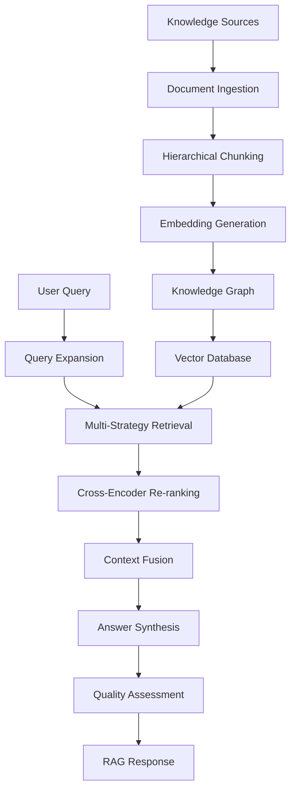

# Advanced RAG (Retrieval-Augmented Generation) System

## Overview

The Advanced RAG System is a comprehensive knowledge retrieval and generation system designed for the AI IDE. It provides intelligent document ingestion, semantic search, context-aware query processing, and high-quality answer synthesis.

## Architecture

### Core Components

1. **Knowledge Base and Retrieval (`rag_system.py`)**
   - Multi-source knowledge ingestion (Documentation, Stack Overflow, GitHub)
   - Advanced embedding models (Sentence Transformers, OpenAI)
   - Hierarchical document chunking
   - Knowledge graph construction
   - Vector similarity search

2. **Context-Aware RAG Pipeline (`rag_pipeline.py`)**
   - Query expansion and reformulation
   - Cross-encoder re-ranking
   - Context fusion from multiple sources
   - Answer synthesis
   - Quality assessment and feedback loops

### System Flow



## Features

### 1. Multi-Source Knowledge Ingestion

#### Supported Sources
- **Documentation Websites**: Crawls documentation sites using sitemaps or web crawling
- **Stack Overflow**: Fetches questions and answers via API
- **GitHub Repositories**: Retrieves README files and repository information
- **Local Files**: Processes local documentation and code files

#### Example Usage
```python
from rag_system import KnowledgeBaseRetrieval, DocumentationSource, SentenceTransformerEmbedding

# Initialize components
embedding_model = SentenceTransformerEmbedding("all-MiniLM-L6-v2")
knowledge_base = KnowledgeBaseRetrieval(embedding_model, storage_path="kb_storage")

# Add documentation source
docs_source = DocumentationSource("https://docs.python.org")
knowledge_base.add_source("python_docs", docs_source)

# Ingest documents
await knowledge_base.ingest_from_source("python_docs", limit=100)
```

### 2. Hierarchical Document Chunking

Documents are chunked hierarchically to preserve structure and context:

- **Document Level**: Overall document summary
- **Section Level**: Major sections and headers
- **Paragraph Level**: Individual paragraphs
- **Code Block Level**: Code snippets and examples
- **List Item Level**: Bullet points and numbered lists

#### Chunking Features
- Configurable chunk sizes and overlap
- Semantic boundary detection
- Code block extraction
- Metadata preservation

### 3. Advanced Embedding Models

#### Supported Models
- **Sentence Transformers**: Local models for semantic embeddings
- **OpenAI Embeddings**: High-quality embeddings via API
- **Custom Models**: Extensible architecture for new models

#### Example Configuration
```python
# Local model
embedding_model = SentenceTransformerEmbedding("all-MiniLM-L6-v2")

# OpenAI model
embedding_model = OpenAIEmbedding(api_key="your-key", model_name="text-embedding-ada-002")
```

### 4. Knowledge Graph Construction

The system builds a knowledge graph to capture relationships between entities:

#### Entity Types
- Functions and methods
- Classes and objects
- Variables and identifiers
- Technologies and frameworks
- API endpoints
- Import statements

#### Relationship Types
- `co_occurs`: Entities appearing together
- `part_of`: Hierarchical relationships
- `related_to`: Semantic relationships
- `uses`: Usage relationships

### 5. Context-Aware Query Processing

#### Query Expansion
- Semantic term expansion using knowledge base
- Programming language synonyms
- Domain-specific keywords
- Session continuity from recent queries

#### Context Types
```python
context = QueryContext(
    user_id="user123",
    programming_language="python",
    framework="django",
    domain="web_development",
    task_type="code_completion",
    current_file="views.py"
)
```

### 6. Multi-Strategy Retrieval

The system uses multiple retrieval strategies and fuses results:

1. **Original Query**: Direct semantic search
2. **Expanded Query**: Search with additional terms
3. **Context-Specific**: Search with context keywords

#### Fusion Strategies
- **Weighted Average**: Combines scores with weights
- **Max Score**: Uses highest score for each chunk
- **Rank Fusion**: Reciprocal rank fusion
- **Adaptive**: Selects strategy based on result quality

### 7. Cross-Encoder Re-ranking

Advanced re-ranking using cross-encoder models for better relevance:

#### Features
- Cross-encoder model scoring
- Context-aware ranking boosts
- Chunk type preferences
- Recency scoring
- Heuristic fallback

#### Ranking Factors
- Semantic relevance
- Context matching (language, framework, domain)
- Content type appropriateness
- Document recency
- Content length optimization

### 8. Answer Synthesis

Task-specific answer synthesis:

#### Code Completion
```python
# Input: "how to define a function in python"
# Output: Code examples with explanations
```

#### Debugging
```python
# Input: "python function not working"
# Output: Potential solutions with sources
```

#### Documentation
```python
# Input: "python class inheritance"
# Output: Structured documentation with examples
```

### 9. Quality Assessment

Comprehensive quality metrics:

#### Metrics
- **Relevance**: How well results match the query
- **Completeness**: Coverage of the query requirements
- **Accuracy**: Quality of source information
- **Clarity**: Readability and structure of answer
- **Timeliness**: Recency of source information

#### Feedback Collection
```python
# Collect user feedback
quality_assessor.collect_feedback("response_id", {
    'rating': 4,
    'helpful': True,
    'comments': 'Good answer but could be more detailed'
})
```

## Usage Examples

### Basic RAG Pipeline

```python
from rag_pipeline import ContextAwareRAGPipeline, QueryContext
from rag_system import KnowledgeBaseRetrieval, SentenceTransformerEmbedding

# Initialize components
embedding_model = SentenceTransformerEmbedding("all-MiniLM-L6-v2")
knowledge_base = KnowledgeBaseRetrieval(embedding_model)
rag_pipeline = ContextAwareRAGPipeline(knowledge_base, embedding_model)

# Process query
context = QueryContext(
    programming_language="python",
    task_type="code_completion"
)

response = await rag_pipeline.process_query(
    "how to create a class in python",
    context
)

print(f"Answer: {response.synthesized_answer}")
print(f"Confidence: {response.confidence_score}")
print(f"Quality: {response.quality_metrics['overall']}")
```

### Advanced Configuration

```python
# Custom embedding model
class CustomEmbeddingModel(EmbeddingModel):
    def encode(self, texts):
        # Custom embedding logic
        return embeddings
    
    def get_dimension(self):
        return 768

# Custom knowledge source
class CustomSource(KnowledgeSource):
    async def fetch_documents(self, query=None, limit=100):
        # Custom document fetching
        return documents
    
    def extract_metadata(self, document):
        # Custom metadata extraction
        return metadata

# Initialize with custom components
embedding_model = CustomEmbeddingModel()
knowledge_base = KnowledgeBaseRetrieval(embedding_model)
knowledge_base.add_source("custom", CustomSource())
```

### Performance Monitoring

```python
# Get performance metrics
metrics = rag_pipeline.get_performance_metrics()

print(f"Total queries: {metrics['total_queries']}")
print(f"Average processing time: {metrics['avg_processing_time']:.2f}s")
print(f"Average confidence: {metrics['avg_confidence']:.2f}")
print(f"Success rate: {metrics['success_rate']:.2f}")
```

## Configuration

### Environment Variables

```bash
# OpenAI API key (optional)
OPENAI_API_KEY=your-openai-key

# Stack Overflow API key (optional)
STACKOVERFLOW_API_KEY=your-stackoverflow-key

# GitHub token (optional)
GITHUB_TOKEN=your-github-token
```

### Storage Configuration

```python
# Configure storage paths
knowledge_base = KnowledgeBaseRetrieval(
    embedding_model=embedding_model,
    storage_path="path/to/knowledge/base"
)

# Storage structure:
# knowledge_base/
# ├── chunks.json          # Document chunks
# ├── embeddings.npy       # Embedding vectors
# └── knowledge_graph.json # Entity relationships
```

### Model Configuration

```python
# Sentence Transformer models
embedding_model = SentenceTransformerEmbedding("all-MiniLM-L6-v2")  # Fast, good quality
embedding_model = SentenceTransformerEmbedding("all-mpnet-base-v2")  # Higher quality
embedding_model = SentenceTransformerEmbedding("multi-qa-MiniLM-L6-cos-v1")  # QA optimized

# Cross-encoder models
reranker = CrossEncoderReranker("cross-encoder/ms-marco-MiniLM-L-6-v2")  # Fast
reranker = CrossEncoderReranker("cross-encoder/ms-marco-electra-base")   # Higher quality
```

## Performance Optimization

### Embedding Caching
- Embeddings are cached to disk
- Incremental updates for changed documents
- Memory-efficient loading

### Query Optimization
- Query result caching
- Batch processing for multiple queries
- Asynchronous processing

### Memory Management
- Configurable chunk sizes
- Embedding compression
- Garbage collection for unused data

## Testing

### Unit Tests
```bash
# Run all RAG system tests
python -m pytest ai-ide/backend/test_rag_system.py -v

# Run RAG pipeline tests
python -m pytest ai-ide/backend/test_rag_pipeline.py -v
```

### Integration Tests
```bash
# Run integration tests
python -m pytest ai-ide/backend/test_rag_integration.py -v
```

### Performance Tests
```bash
# Run performance benchmarks
python ai-ide/backend/test_rag_integration.py
```

## Troubleshooting

### Common Issues

1. **Memory Issues**
   - Reduce chunk size: `HierarchicalChunker(max_chunk_size=256)`
   - Use smaller embedding models
   - Enable embedding compression

2. **Slow Performance**
   - Use faster embedding models
   - Reduce top_k in searches
   - Enable result caching

3. **Poor Quality Results**
   - Increase chunk overlap
   - Use higher quality embedding models
   - Improve query expansion
   - Add more diverse knowledge sources

### Debug Mode
```python
import logging
logging.basicConfig(level=logging.DEBUG)

# Enable detailed logging
logger = logging.getLogger('rag_system')
logger.setLevel(logging.DEBUG)
```

## Future Enhancements

### Planned Features
1. **Vector Database Integration**: ChromaDB, Pinecone, Weaviate
2. **Advanced Chunking**: Semantic chunking, sliding windows
3. **Multi-modal Support**: Images, diagrams, videos
4. **Real-time Updates**: Live document monitoring
5. **Federated Search**: Multiple knowledge bases
6. **Advanced Analytics**: Usage patterns, quality trends

### Extensibility
The system is designed for easy extension:
- Custom knowledge sources
- Custom embedding models
- Custom re-ranking strategies
- Custom answer synthesis
- Custom quality metrics

## API Reference

### Core Classes

#### `KnowledgeBaseRetrieval`
Main knowledge base management class.

**Methods:**
- `add_source(name, source)`: Add a knowledge source
- `ingest_from_source(source_name, query, limit)`: Ingest documents
- `search(query, top_k, chunk_types)`: Search for relevant chunks
- `get_related_chunks(chunk_id, max_related)`: Get related chunks
- `save()`: Save knowledge base to disk
- `load()`: Load knowledge base from disk

#### `ContextAwareRAGPipeline`
Main RAG pipeline for query processing.

**Methods:**
- `process_query(query, context, top_k)`: Process a complete query
- `get_performance_metrics()`: Get performance statistics

#### `QueryContext`
Context information for queries.

**Attributes:**
- `user_id`: User identifier
- `programming_language`: Programming language context
- `framework`: Framework context
- `domain`: Domain context
- `task_type`: Type of task (code_completion, debugging, documentation)

#### `RAGResponse`
Complete response from RAG pipeline.

**Attributes:**
- `query`: Original query
- `synthesized_answer`: Generated answer
- `confidence_score`: Confidence in the answer
- `quality_metrics`: Quality assessment metrics
- `processing_time`: Time taken to process

## License

This RAG system is part of the AI IDE project and follows the same licensing terms.